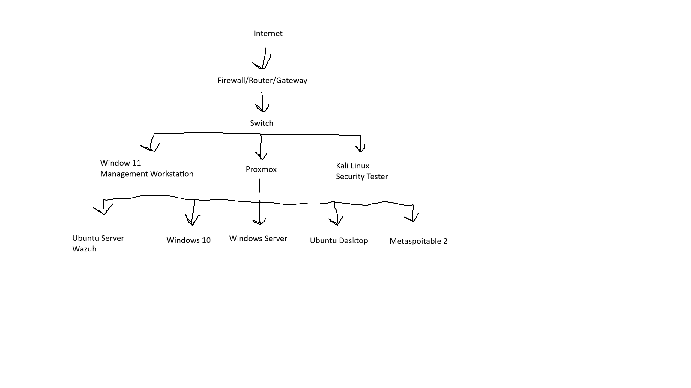
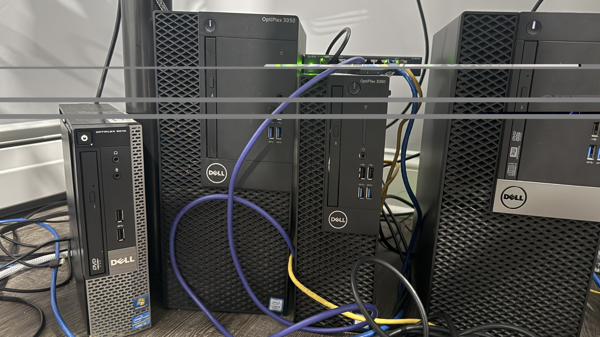
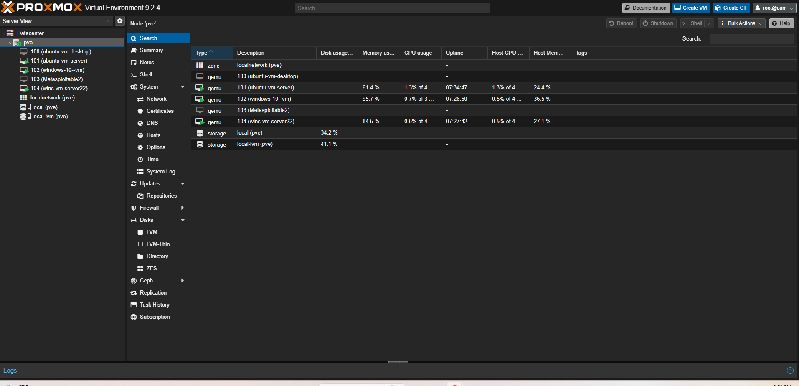

# Cybersecurity Homelab

## Overview

This project documents the physical cybersecurity homelab I built using repurposed Dell OptiPlex computers.

The purpose of the lab is to create a realistic environment where I can practice networking, system administration, virtualization, Active Directory, Linux, firewall configuration, security monitoring, and offensive and defensive cybersecurity techniques.

Instead of running the entire lab from a single computer, I assigned different physical systems specific roles and use Proxmox to host several virtual machines. I also built a dedicated lab network using pfSense as the firewall, router, and default gateway, along with an 8-port Ethernet switch to provide wired connectivity between the physical systems.

This homelab serves as the foundation for a growing cybersecurity portfolio spanning network security, Windows enterprise administration, security monitoring and detection engineering, and malware analysis.

The projects built on this environment progress from infrastructure and network security into enterprise administration, detection engineering, and malware analysis. Each featured project has its own repository with detailed technical documentation, screenshots, testing, and findings.

## Network Architecture



*Network architecture of my physical and virtual cybersecurity homelab.*

## Physical Hardware



*Physical homelab consisting of repurposed Dell OptiPlex systems and an 8-port Ethernet switch.*

The lab is built using several Dell OptiPlex systems that were repurposed from my workplace.

I upgraded some of the systems with additional RAM and storage so they could better support virtualization and security tools.

### Dell OptiPlex 3050

**Operating System:** Windows 11
**Role:** Management Workstation

This is my primary computer for managing and accessing the rest of the homelab.

I use this system to:

* Access the Proxmox web interface
* Manage virtual machines
* Connect to the physical Kali Linux workstation using SSH for remote security testing
* Access Wazuh
* Configure pfSense
* Administer Windows Server and Active Directory
* Perform general lab management and troubleshooting

### Dell OptiPlex 9010

**Platform:** Proxmox VE
**Role:** Virtualization Host



*Proxmox VE dashboard showing the virtual machines used throughout the homelab.*

The OptiPlex 9010 runs Proxmox and hosts the majority of the virtual machines used in the lab.

Virtual machines hosted on this system include:

* Windows Server 2022
* Windows 10 domain workstation
* Ubuntu Server
* Ubuntu Desktop
* Metasploitable 2
* Windows 10 malware-analysis VM
* REMnux malware-analysis VM

The malware-analysis VMs use a separate Proxmox-only network with no physical uplink, host IP, pfSense route, or default gateway, keeping that environment isolated from the primary homelab and public Internet.

Proxmox allows me to manage multiple operating systems from one physical server while learning virtualization, resource allocation, virtual networking, and system administration.

### Dell OptiPlex 3040

**Platform:** pfSense
**Role:** Firewall, Router, and Default Gateway

The OptiPlex 3040 is dedicated to running pfSense and serves as the firewall, router, and default gateway for my cybersecurity homelab.

All physical and virtual systems in the lab use pfSense as their default gateway.

During the build, I initially purchased an inexpensive network interface card that was not compatible with pfSense. After troubleshooting the issue and researching hardware compatibility, I purchased replacement NICs that were properly supported and successfully completed the firewall and router configuration.

This system is used for:

* Routing network traffic
* Firewall configuration
* Traffic filtering
* Firewall rules
* Network aliases
* DHCP reservations
* Packet capture and traffic analysis
* Network monitoring

### Dell OptiPlex 3060

**Operating System:** Kali Linux
**Role:** Security Testing Workstation

Kali Linux runs directly on the OptiPlex 3060 as a physical security testing system.

I remotely access Kali from my Windows 11 management workstation using SSH and use it to perform controlled security testing against systems within the homelab.

Activities include:

* Nmap scanning
* Network reconnaissance
* Port and service discovery
* Connectivity testing
* Metasploit testing
* Controlled exploitation of Metasploitable 2
* Generating activity for firewall and security monitoring analysis

## Network Infrastructure

The homelab uses a dedicated 8-port Ethernet switch to provide wired network connectivity between the physical systems.

The Dell OptiPlex 3040 running pfSense serves as the **firewall, router, DHCP server, and default gateway** for the primary lab environment. All physical systems and virtual machines on the main lab network use pfSense as their default gateway for traffic leaving the local network.
Because the lab currently uses a flat network connected through an unmanaged Ethernet switch, communication between systems on the same subnet can occur directly through the switch without traversing pfSense. Traffic destined for external networks is routed through pfSense, where firewall policies can be applied.
The physical network consists of:

* **Dell OptiPlex 3040** — pfSense firewall, router, and default gateway
* **8-port Ethernet switch** — Provides wired connectivity between the lab systems
* **Dell OptiPlex 3050** — Windows 11 management workstation
* **Dell OptiPlex 9010** — Proxmox virtualization server
* **Dell OptiPlex 3060** — Kali Linux security testing workstation

The virtual machines hosted by Proxmox communicate through the Proxmox server's network connection and also use pfSense as their default gateway.

This setup gives me a dedicated environment where I can configure firewall policies, manage DHCP addressing, monitor routed network traffic, perform security testing, and analyze communication between physical and virtual systems.

> **Future Improvement:** The current lab uses an unmanaged Ethernet switch and a flat network. A future upgrade to a VLAN-capable managed switch would allow the environment to be segmented into separate management, server, client, security testing, and vulnerable-target networks, with pfSense enforcing policies between them.

## Virtual Machines

The Proxmox server hosts several virtual machines that each serve a specific role within the environment.

### Windows Server 2022

Windows Server 2022 serves as the Domain Controller for my Active Directory environment.

I created a simulated business environment with multiple users assigned to different departments and security groups. I also configured Group Policy Objects (GPOs) to centrally manage resources for domain users, including department-specific mapped network drives.

The Windows 10 virtual machine is joined to the Active Directory domain and uses the Windows Server 2022 Domain Controller for DNS resolution.

This environment gives me hands-on experience with:

* Active Directory Domain Services
* Domain Controller administration
* User and group management
* Security groups
* Group Policy
* DNS
* Domain-joined Windows endpoints
* Network resource management
* Windows authentication
* Security logging

Detailed Active Directory configurations, users, security groups, GPOs, and testing are documented separately in my **Active Directory Security Lab**.

### Windows 10

Used as a domain-joined Windows endpoint for:

* Active Directory domain testing
* Windows authentication
* Sysmon monitoring
* PowerShell logging
* Wazuh agent monitoring
* Security testing
* Authentication analysis

The system uses the Windows Server 2022 Domain Controller for DNS resolution and pfSense as its default gateway.

### Ubuntu Server

Ubuntu Server is used to host my Wazuh security monitoring infrastructure.

Preparing the server required me to work with Linux server administration, package installation, networking, service management, and troubleshooting.

The server provides the centralized Wazuh infrastructure used to collect and analyze security telemetry generated throughout the lab.

### Ubuntu Desktop

Used as a Linux workstation for:

* Linux administration
* Networking practice
* Connectivity testing
* General lab testing

### Metasploitable 2

Metasploitable 2 is an intentionally vulnerable Linux system used as a controlled target for security testing.

I use the physical Kali Linux workstation to scan and interact with Metasploitable 2 and practice controlled exploitation using Metasploit Framework.

This provides a safe environment for practicing reconnaissance, vulnerability discovery, and exploitation while observing how suspicious activity appears across the lab network and security monitoring tools.

## SSH & Remote Security Testing

Building the homelab gave me hands-on experience using SSH as part of my security testing workflow.

I use SSH to remotely connect from my Windows 11 management workstation to the physical Kali Linux machine. This allows me to control Kali remotely and perform security testing against the virtual machines running within the Proxmox environment.

From the Kali system, I use tools such as Nmap to scan the virtual machines, identify active hosts, discover open ports, and examine services running across the lab network.

I also use Kali to launch Metasploit Framework (`msfconsole`) and perform controlled exploitation against the intentionally vulnerable Metasploitable 2 virtual machine.

This workflow gave me practical experience with:

* Remotely accessing Kali Linux using SSH
* Linux command-line navigation
* Running Nmap scans from a remote Kali system
* Identifying hosts, ports, and services
* Using Metasploit Framework (`msfconsole`)
* Testing exploits against Metasploitable 2
* Establishing sessions with a vulnerable target in a controlled environment
* Understanding communication between physical and virtual systems

Using SSH allows me to perform testing directly from my Windows 11 management workstation while the security tools and testing activity are executed from the dedicated physical Kali Linux machine.

## Hardware Upgrades and Troubleshooting

The original computers had limited hardware resources, so I upgraded systems with additional RAM and storage where needed.

I also encountered a hardware compatibility issue while building the pfSense firewall.

The first NIC I purchased was not recognized properly by pfSense. After researching the issue, I determined that the hardware was not properly supported and replaced it with compatible network interface cards.

I also added an 8-port Ethernet switch to the environment so the physical systems could connect to the dedicated pfSense-controlled lab network.

These experiences helped reinforce the importance of:

* Hardware compatibility research
* Driver support
* Troubleshooting
* Network interface configuration
* Physical network design
* Planning hardware around operating system requirements

## Lab Environment

| Platform / Operating System | Role | System |
| --- | --- | --- |
| Windows 11 | Management workstation | Dell OptiPlex 3050 |
| Proxmox VE | Virtualization host | Dell OptiPlex 9010 |
| pfSense | Firewall / Router / DHCP / Default Gateway | Dell OptiPlex 3040 |
| Kali Linux | Security testing workstation | Dell OptiPlex 3060 |
| Ethernet | Physical network connectivity | 8-Port Ethernet Switch |
| Windows Server 2022 | Active Directory / Domain Controller / DNS | Virtual Machine |
| Windows 10 | Domain-joined Windows endpoint | Virtual Machine |
| Ubuntu Server | Wazuh server | Virtual Machine |
| Ubuntu Desktop | Linux workstation | Virtual Machine |
| Metasploitable 2 | Vulnerable testing target | Virtual Machine |
| Windows 10 | Isolated malware-analysis workstation | Virtual Machine |
| REMnux | Malware network-analysis / simulated-services system | Virtual Machine |

## Featured Cybersecurity Projects

The homelab became the foundation for four dedicated cybersecurity projects. Together, they demonstrate a progression from network security and enterprise administration into security monitoring, detection engineering, and malware analysis.

### 1. Network Security & pfSense Lab

**Repository:** https://github.com/jtechprojects/pfsense-network-security-lab

Built around the dedicated physical pfSense firewall, this project focuses on practical network-security administration and traffic analysis.

**Highlights:**

- Configured pfSense as the lab firewall, router, DHCP server, and default gateway.
- Created and validated firewall rules and network aliases.
- Performed packet capture and traffic analysis.
- Used Kali Linux and Nmap to generate and observe controlled network activity.
- Practiced connectivity troubleshooting and firewall-policy validation.

### 2. Active Directory Security Lab

**Repository:** https://github.com/jtechprojects/active-directory-security-lab

Built a Windows enterprise environment using Windows Server 2022 and a domain-joined Windows 10 workstation.

**Highlights:**

- Configured Active Directory Domain Services and DNS.
- Created organizational users, departments, and security groups.
- Implemented Group Policy Objects (GPOs).
- Configured department-specific network resources and access controls.
- Validated authentication, policy application, and domain administration.

### 3. Wazuh Detection Engineering Lab

**Repository:** https://github.com/jtechprojects/wazuh-detection-engineering-lab

Extended the environment into a detection-engineering and SOC-analysis lab using Wazuh, Sysmon, Windows Event Logging, and PowerShell telemetry.

**Highlights:**

- Centralized endpoint security telemetry in Wazuh.
- Used Sysmon and Windows logging to investigate process and authentication activity.
- Enabled PowerShell Script Block Logging.
- Created custom Wazuh detection rules.
- Mapped detections to MITRE ATT&CK techniques.
- Tested detections against multiple execution methods.
- Identified detection gaps and performed false-positive analysis and rule tuning.

### 4. Malware Analysis Sandbox

**Repository:** https://github.com/jtechprojects/malware-analysis-sandbox

Built a dedicated malware-analysis environment on Proxmox with stronger isolation requirements than the primary homelab network.

**Highlights:**

- Created an isolated Proxmox network with no physical uplink or route to the primary homelab or Internet.
- Deployed Windows 10 and REMnux analysis systems.
- Configured FakeDNS and INetSim for controlled simulated network services.
- Developed a custom Python malware-triage tool for hashing, strings extraction, PE analysis, entropy analysis, import inspection, YARA scanning, and report generation.
- Performed manual static and controlled dynamic analysis.
- Developed, debugged, and validated original YARA detection rules.
- Documented negative and inconclusive findings without overstating runtime evidence.

## Portfolio Progression

```text
Physical Cybersecurity Homelab
            |
            v
Network Security & pfSense
            |
            v
Active Directory Security
            |
            v
Wazuh Detection Engineering
            |
            v
Malware Analysis & YARA Detection
```

Each project builds on skills developed in the previous stages while introducing a deeper security focus. The result is a connected portfolio rather than a collection of unrelated labs.

## Skills Demonstrated

### Infrastructure & Systems

- Physical computer upgrades and hardware troubleshooting
- Proxmox virtualization and virtual networking
- Windows Server and Windows administration
- Linux administration
- VM snapshots and isolated analysis environments

### Networking & Security

- pfSense firewall administration
- Routing, DNS, DHCP, and Ethernet switching
- Firewall rules and aliases
- Nmap reconnaissance and service discovery
- Packet capture and traffic analysis
- SSH administration
- Controlled exploitation with Metasploit

### Identity & Enterprise Administration

- Active Directory Domain Services
- Domain Controller administration
- User, group, and security-group management
- Group Policy
- Domain-joined Windows endpoints
- Windows authentication and security logging

### Detection & Malware Analysis

- Wazuh SIEM/XDR
- Sysmon and Windows Event Logging
- PowerShell logging
- Custom detection rules and MITRE ATT&CK mapping
- Detection testing and tuning
- Static and dynamic malware analysis
- Python malware-analysis automation
- PE analysis and entropy analysis
- YARA rule development and validation
- REMnux, FakeDNS, and INetSim

## Portfolio Summary

What began as a project to repurpose several Dell OptiPlex systems developed into a hands-on cybersecurity environment supporting network defense, enterprise Windows administration, offensive testing, security monitoring, detection engineering, and malware analysis.

The lab has given me experience not only configuring security technologies, but also validating whether they work as intended, troubleshooting failures, generating security telemetry, analyzing evidence, testing hypotheses, and documenting technical findings.

The individual repositories above contain the detailed implementation, screenshots, testing, and analysis for each project.
